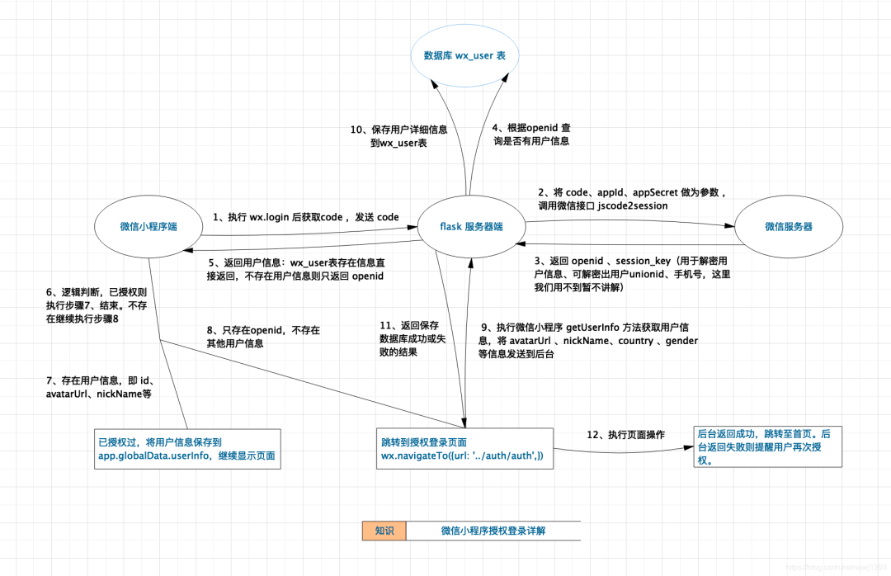
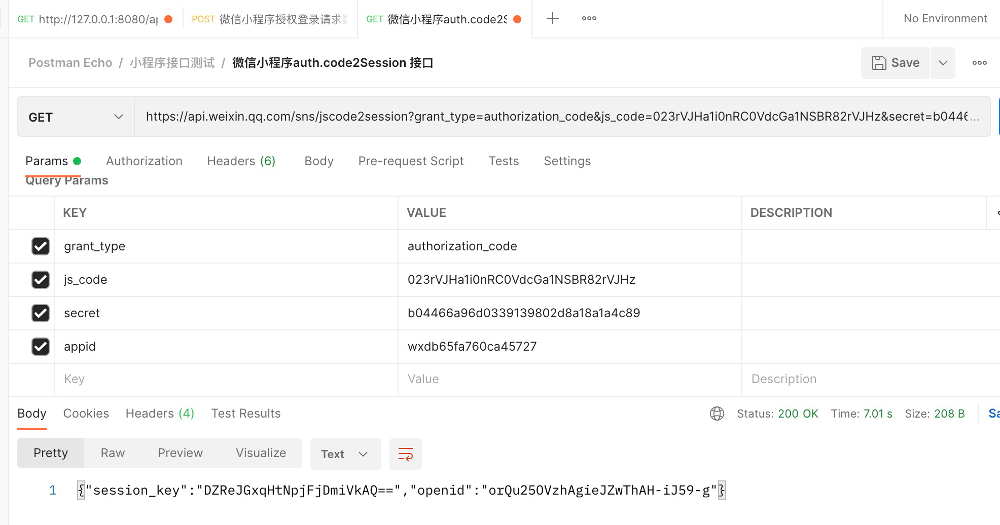
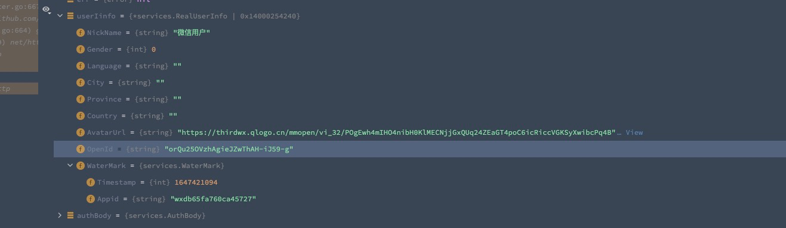

### 微信小程序：授权登录 + 基于token的身份验证详解

> 微信小程序授权登录与用户信息保存流程



1.前端调用wx.login()获取code值（下面是请求完整的数据）
```
{
  "code": "013b2C100leDsN1iBq0000WKtQ3b2C1a",
  "userInfo": {
    "errMsg": "getUserInfo:ok",
    "rawData": "{\"nickName\":\"微信用户\",\"gender\":0,\"language\":\"\",\"city\":\"\",\"province\":\"\",\"country\":\"\",\"avatarUrl\":\"https://thirdwx.qlogo.cn/mmopen/vi_32/POgEwh4mIHO4nibH0KlMECNjjGxQUq24ZEaGT4poC6icRiccVGKSyXwibcPq4BWmiaIGuG1icwxaQX6grC9VemZoJ8rg/132\"}",
    "userInfo": {
      "nickName": "微信用户",
      "gender": 0,
      "language": "",
      "city": "",
      "province": "",
      "country": "",
      "avatarUrl": "https://thirdwx.qlogo.cn/mmopen/vi_32/POgEwh4mIHO4nibH0KlMECNjjGxQUq24ZEaGT4poC6icRiccVGKSyXwibcPq4BWmiaIGuG1icwxaQX6grC9VemZoJ8rg/132"
    },
    "signature": "4fd5cf154e20912ff627d57a86218b933f038642",
    "encryptedData": "Auexsp85K06ipbURLtoU02d9trwqMhPcltxkw2F/hpGJRyg2Ayb/4zO88Li5VDDaC3mU9We2NFi7wnOv8KOfnIUlo7Oou+UwR+CNv9UHCDUVN9Bkyg8FXCg+HXxtn7U6fjbzmwmGKa+/zdNRAQgLJO0u9SL9iJlfSuoRc9T7C73LAhSoiRjRZEzo4g1sVtVBnApfh5mZKXjojgDX5XIXi6RTKC/spbjeC34aQ02CLWhWThWR+V6W7jl+IIhzW1RKiDYfCoLKy+aUuVceuHOO9Xqg7wQipHwPJii0+5bjDq8sU20r/t1N1FLAPDIjApsJMK4muCNlxUxuxLKZC3O2VL5T60YoIJnURC0cv9YqAXGOEZG1oFZFkUIlF+36EhkYfWuoQMlrxxd06eg/PT1QlWxcxszn35nUs75+TbEmfXvyU/t14zfYetzDMn+w/Stg8jjZhBoVfQ+WPJFS9uAVvA==",
    "iv": "7d6P/2K++JGmdKrM0YesjQ==",
    "cloudID": "54_3GhfW8Ei2dc5GTP9exXNVj7-Q877naFZFGeK-UbWNP7YA9oCXX6PwOC99gw"
  }
}
```

2.前端通过调用wx.getUserInfo获取iv、rawData、signature、encryptedData等加密数据，传递给后端

3.服务器通过code请求api换回session_key和openid（下面是成功返回后的数据）


4.服务器通过前端给的rawData 加获取的session_key使用sha1加密，计算出signature1

5.比对前端传的signature和自己算出来的signature1是否一致（防止数据不一致）

6.用AES算法解密encryptedData里的敏感数据



7.拿着敏感数据后做自己的逻辑

8.通知前端登陆成功